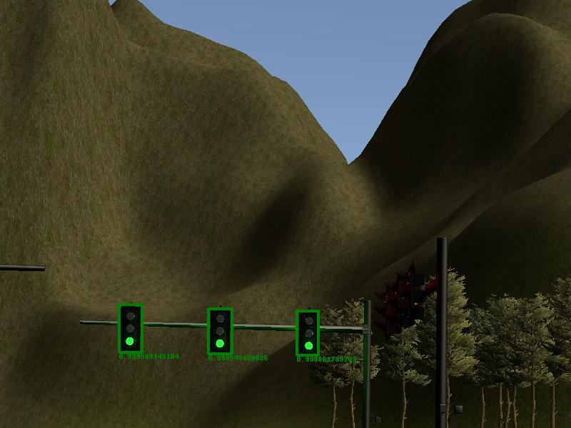
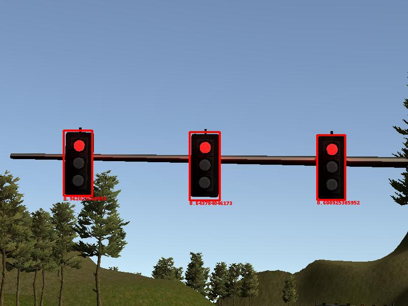
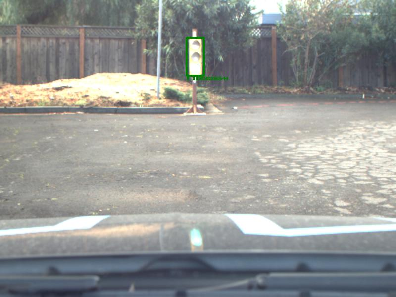
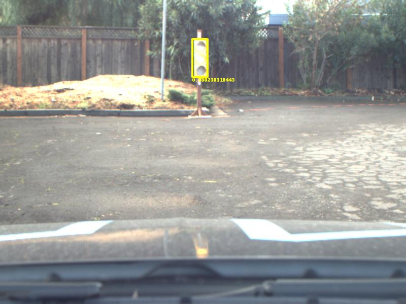
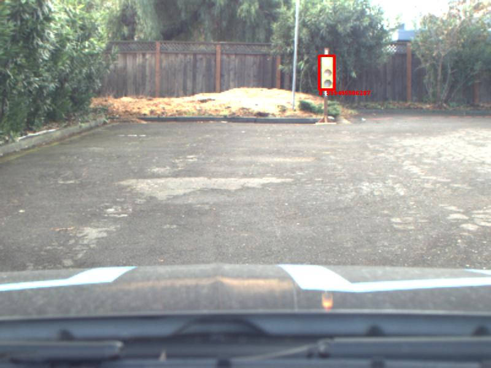
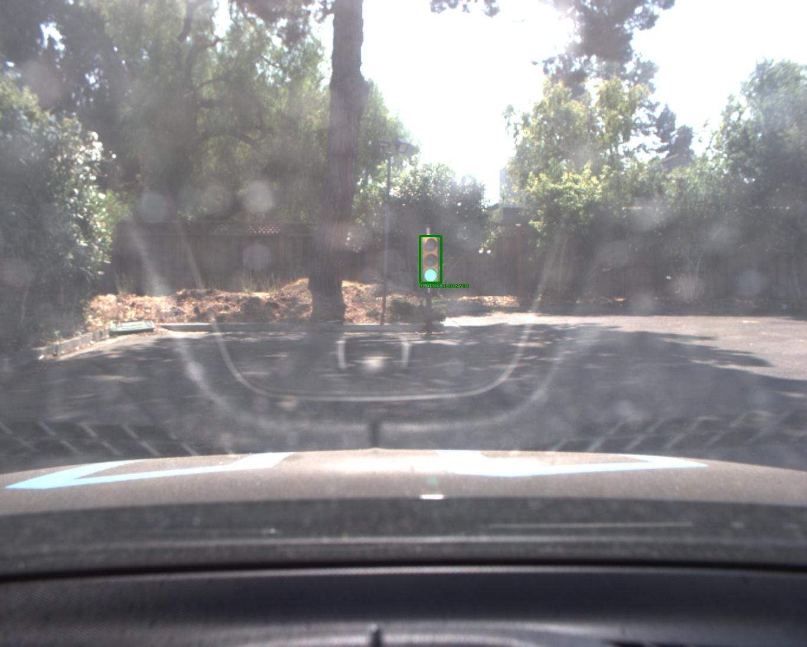
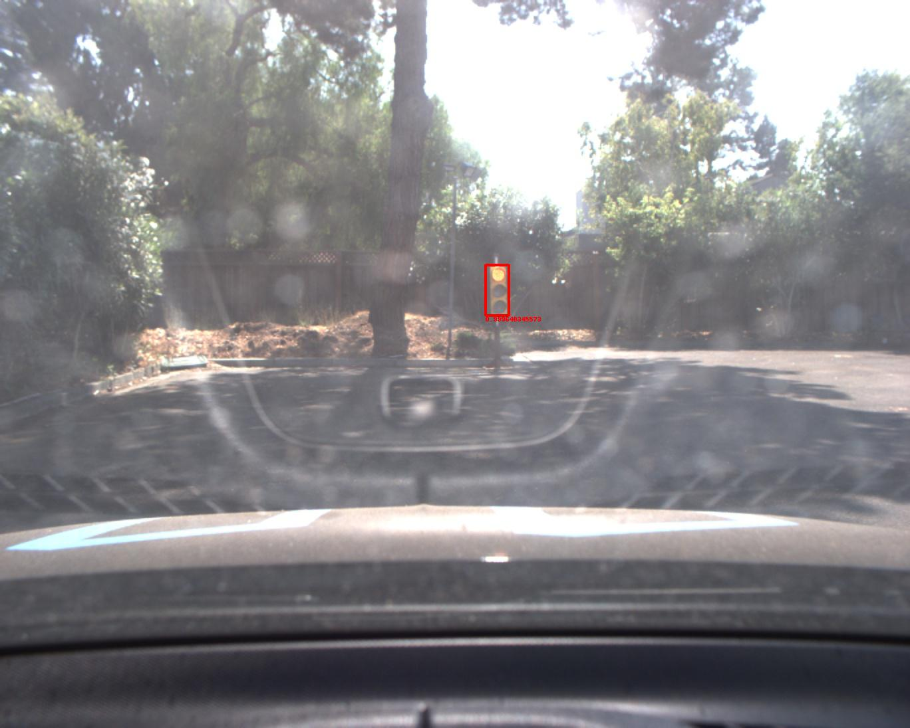
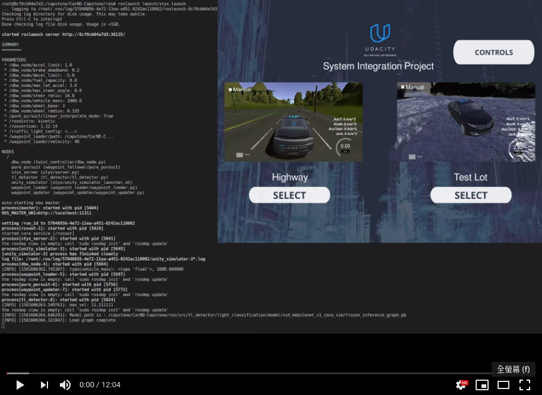

This is the project repo for the final project of the Udacity Self-Driving Car Nanodegree: Programming a Real Self-Driving Car. For more information about the project, see the project introduction [here](https://classroom.udacity.com/nanodegrees/nd013/parts/6047fe34-d93c-4f50-8336-b70ef10cb4b2/modules/e1a23b06-329a-4684-a717-ad476f0d8dff/lessons/462c933d-9f24-42d3-8bdc-a08a5fc866e4/concepts/5ab4b122-83e6-436d-850f-9f4d26627fd9).  

### Team

I complete this project individually, so there is only one member.

|         Name         |                       GitHub account                       |                 Udacity Email                 |
|:--------------------:|:----------------------------------------------------------:|:---------------------------------------------:|
| Josper Tsai (Leader) | [Josper Tsai](https://github.com/hcv1027?tab=repositories) | [hcv1027@gmail.com](mailto:hcv1027@gmail.com) |

---


Please use **one** of the two installation options, either native **or** docker installation.

### Native Installation

* Be sure that your workstation is running Ubuntu 16.04 Xenial Xerus or Ubuntu 14.04 Trusty Tahir. [Ubuntu downloads can be found here](https://www.ubuntu.com/download/desktop).
* If using a Virtual Machine to install Ubuntu, use the following configuration as minimum:
  * 2 CPU
  * 2 GB system memory
  * 25 GB of free hard drive space

  The Udacity provided virtual machine has ROS and Dataspeed DBW already installed, so you can skip the next two steps if you are using this.

* Follow these instructions to install ROS
  * [ROS Kinetic](http://wiki.ros.org/kinetic/Installation/Ubuntu) if you have Ubuntu 16.04.
  * [ROS Indigo](http://wiki.ros.org/indigo/Installation/Ubuntu) if you have Ubuntu 14.04.
* [Dataspeed DBW](https://bitbucket.org/DataspeedInc/dbw_mkz_ros)
  * Use this option to install the SDK on a workstation that already has ROS installed: [One Line SDK Install (binary)](https://bitbucket.org/DataspeedInc/dbw_mkz_ros/src/81e63fcc335d7b64139d7482017d6a97b405e250/ROS_SETUP.md?fileviewer=file-view-default)
* Download the [Udacity Simulator](https://github.com/udacity/CarND-Capstone/releases).

### Docker Installation
[Install Docker](https://docs.docker.com/engine/installation/)

Build the docker container
```bash
docker build . -t capstone
```

Run the docker file
```bash
docker run -p 4567:4567 -v $PWD:/capstone -v /tmp/log:/root/.ros/ --rm -it capstone
```

### Port Forwarding
To set up port forwarding, please refer to the "uWebSocketIO Starter Guide" found in the classroom (see Extended Kalman Filter Project lesson).

### Usage

1. Clone the project repository
```bash
git clone https://github.com/udacity/CarND-Capstone.git
```

2. Install python dependencies
```bash
cd CarND-Capstone
pip install -r requirements.txt
```
3. Make and run styx
```bash
cd ros
catkin_make
source devel/setup.sh
roslaunch launch/styx.launch
```
4. Run the simulator

### Real world testing
1. Download [training bag](https://s3-us-west-1.amazonaws.com/udacity-selfdrivingcar/traffic_light_bag_file.zip) that was recorded on the Udacity self-driving car.
2. Unzip the file
```bash
unzip traffic_light_bag_file.zip
```
3. Play the bag file
```bash
rosbag play -l traffic_light_bag_file/traffic_light_training.bag
```
4. Launch your project in site mode
```bash
cd CarND-Capstone/ros
roslaunch launch/site.launch
```
5. Confirm that traffic light detection works on real life images

### Other library/driver information
Outside of `requirements.txt`, here is information on other driver/library versions used in the simulator and Carla:

Specific to these libraries, the simulator grader and Carla use the following:

|               | Simulator |  Carla  |
|:-------------:|:---------:|:-------:|
| Nvidia driver |  384.130  | 384.130 |
|     CUDA      |  8.0.61   | 8.0.61  |
|     cuDNN     |  6.0.21   | 6.0.21  |
|   TensorRT    |    N/A    |   N/A   |
|    OpenCV     | 3.2.0-dev |  2.4.8  |
|    OpenMP     |    N/A    |   N/A   |

We are working on a fix to line up the OpenCV versions between the two.

---

### Description

#### System Architecture Diagram
The following is a system architecture diagram showing the ROS nodes and topics used in the project.  


#### WaypointLoader
It works like a global trajectory generator. `waypoint_loader.py` will load a fixed path from csv file, add velocity information accroading to the vehicle's velocity limitation, and finally publishe these waypoints through the topic `/base_waypoints` **once**.  

When I trace the code of `waypoint_loader.py`, I notice that I can't understand a formula which is used to compute the decelerate velocity. Finally I found the explanation [here](https://libraries.io/github/maxitar/CarND-Capstone). If you have the same question, you can reference this link to see the explanation.

```python
def decelerate(self, waypoints):
    last = waypoints[-1]
    last.twist.twist.linear.x = 0.
    for wp in waypoints[:-1][::-1]:
        dist = self.distance(wp.pose.pose.position, last.pose.pose.position)
        # What's the meaning of this formula?            
        vel = math.sqrt(2 * MAX_DECEL * dist)
        if vel < 1.:
            vel = 0.
        wp.twist.twist.linear.x = min(vel, wp.twist.twist.linear.x)
    return waypoints
```


#### WaypointUpdater

It is one of the main function I need to implement in this project. It works as a local path planner, receives:  
1. A global trajectory from topic `/base_waypoints` which is provided by `WaypointLoader`.
2. Sensor fusion information like traffic light provided by `TrafficLightDetector` through the topic `/traffic_waypoint`. 

Then `waypoint_updater.py` generates a final trajectory based on dynamic conditions.(Ex: Traffic light, obstacles, ect.) and finally publishs to the topic `/final_waypoints`.

I use the `jerk minization trajectory` method to generate the waypoints trajectory which follows the rule of traffic light state and the limitation of vehicle's velocity and acceleration.


#### TrafficLightDetector

It is one of the main function I need to implement in this project. `tl_classifier.py` is responsible for traffic light detection and classification.  

Before this project, I have no experience of object detection project. So I first study [this project](https://github.com/hcv1027/CarND-Object-Detection-Lab) for beginning. But I'm still a little confused about the role of *SSD* and *MobileNet* intruduced in this project, and I found the answer here: Q&A: [Difference between SSD and Mobilenet](https://stackoverflow.com/questions/50585597/difference-between-ssd-and-mobilenet).  

If this is your first time to use Tensorflow's `Object Detection API` like me, I strongly suggest you to read [this repository](https://github.com/alex-lechner/Traffic-Light-Classification) or [this article](https://medium.com/@WuStangDan/step-by-step-tensorflow-object-detection-api-tutorial-part-1-selecting-a-model-a02b6aabe39e). Both of these two authors describe how to start in detail. Believe me, you will have less pain in the process of using `Object Detection API` if you read these articles first. But if you try by yourself first, and then read these articles, you will have another kind of fun, haha.

Anyway, I finally choose `ssd_inception_v2_coco` as the pretrained model for detecting the real traffic light image provided by Udacity's [training bag](https://s3-us-west-1.amazonaws.com/udacity-selfdrivingcar/traffic_light_bag_file.zip). And use `ssd_mobilenet_v1_coco` as the pretrained model to detect simulator's traffic light image.  

Here are some result images:  









#### WaypointFollower

It's responsible for path tracking. It receives the `/final_waypoints` published from `waypoint_updater` and uses [pure pursuit algorithm](https://www.ri.cmu.edu/pub_files/pub3/coulter_r_craig_1992_1/coulter_r_craig_1992_1.pdf) to choose next waypoint to follow, then publishes the relative linear and angular velocity commands to let vehicle follow the trajectory.  

As I trace the code of `pure_pursuit_core.cpp`, I read this article to learn the definition of [curvature](https://www.khanacademy.org/math/multivariable-calculus/multivariable-derivatives/differentiating-vector-valued-functions/a/curvature). But until now, I still have a question about the formula used in below function, if you know the answer, feel free to post an issue here to let me know.
```c++
double PurePursuit::calcCurvature(geometry_msgs::Point target) const
{
  double kappa;
  double denominator = pow(getPlaneDistance(target, current_pose_.pose.position), 2);
  double numerator = 2 * calcRelativeCoordinate(target, current_pose_.pose).y;

  // Why??
  if (denominator != 0)
    kappa = numerator / denominator;
  else
  {
    if(numerator > 0)
     kappa = KAPPA_MIN_;
    else
      kappa = -KAPPA_MIN_;
  }
  ROS_INFO_STREAM("kappa :" << kappa);
  return kappa;
}
```

#### TwistController

It is one of the main function I need to implement in this project. It works for computing the value of throttle, steer and brake accroading to the current vehicle's linear and angular velocities and the desired linear and angular velocities published by `WaypointFollower`.

#### Final video

Here is the video of my project's final result:  
<a href="https://youtu.be/TJ5hbhmTOow" target="_blank"></a>