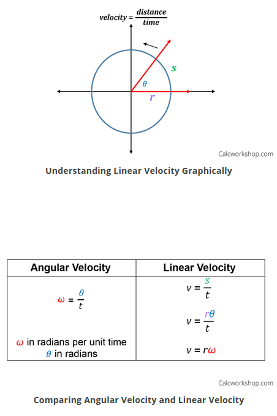
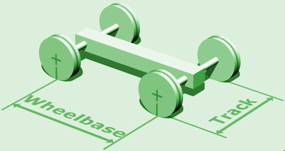

### waypoint_loader

#### waypoint_loader.py

It works like a global trajectory generator, it loads a fixed global trajectory, and publishes it through the topic `/base_waypoints`.

```python
def decelerate(self, waypoints):
        last = waypoints[-1]
        last.twist.twist.linear.x = 0.
        for wp in waypoints[:-1][::-1]:
            dist = self.distance(wp.pose.pose.position, last.pose.pose.position)
            # What's the meaning of this line?
            vel = math.sqrt(2 * MAX_DECEL * dist)
            if vel < 1.:
                vel = 0.
            wp.twist.twist.linear.x = min(vel, wp.twist.twist.linear.x)
        return waypoints
```

1. Coordinate is local or global?
2. Velocity is only set to x-direction.<p>
   Ans: Because in `geometry_msgs/TwistStamped` message, moving forward is in x direction.
---

### waypoint_updater

#### waypoint_updater.py

I think it works like a local path planner, receives a trajectory from topic `/base_waypoints`, and generae a final trajectory based on dynamic conditions.(Ex: Traffic light, obstacles, ect.)

Walkthrough:<p>
1. Using KDTree so search closest waypoint
2. Using loop function to control publish frequency, 50 hz
3. Make sure the closest waypoint return from KDTree is in front of our car, not behind out car. For this requirement, we use hyperplane, and compute dot product.
4. We need to do some logic check when we loop all the way back around.

---

### waypoint_follower

It works like a trajectory follower, it receives the final trajectory publishes from `waypoint_updater` and makes a velocity command to follow this trajectory. It uses `pure pursuit` algorithm to follow the trajectory.

#### pure_pursuit.cpp

It is a ros node to interact with other ros packages.

#### pure_pursuit_core.cpp

It is the implementation of the algorithm `pure pursuit`.

[Curvature](https://www.khanacademy.org/math/multivariable-calculus/multivariable-derivatives/differentiating-vector-valued-functions/a/curvature)

```c++
double PurePursuit::calcCurvature(geometry_msgs::Point target) const
{
  double kappa;
  double denominator = pow(getPlaneDistance(target, current_pose_.pose.position), 2);
  double numerator = 2 * calcRelativeCoordinate(target, current_pose_.pose).y;

  // Why??
  if (denominator != 0)
    kappa = numerator / denominator;
  else
  {
    if(numerator > 0)
     kappa = KAPPA_MIN_;
    else
      kappa = -KAPPA_MIN_;
  }
  ROS_INFO_STREAM("kappa :" << kappa);
  return kappa;
}
```



Lateral acceleration is **Centripetal Acceleration** (I'm not sure about this part). The formula of **Centripetal Acceleration** is $a=v^2/R$. The relation of linear velocity and angular velocity is $v=omega*R$. So we can also compute **Centripetal Acceleration** by $a=v*omega$.
```c++
PurePursuit::outputTwist {
  // Limit the lateral acceleration to g_lateral_accel_limit
  // lateral_acceleration = linear_velocity * angular_velocity;
  double g_lateral_accel_limit = 5.0;
}
```

#### libwaypoint_follower.cpp

It includes all tool functions for `pure_pursuit_core`.

---

### twist_controller

#### Config

1. Wheelbase<p>
   
2. Brake deadband?
3. Steering ratio?
4. fuel capacity is used for compute more precise mass of vehicle
5. Break should be in units of torque.(Newton meters)
6. Frequency does matter here. Target: 50 hz. Less than 20 hz will shutdown.
7. Throttle: 0~1
8. Low pass filter is filtering out all of the high frequency noise in the velocity.
9. Suggest to modify waypoints_follower to check if vehicle follows the waypoints all the time.

```c++
// Convert mile/hour to meter/second
inline double mph2ms(double mph) { return mph * 0.44704; }

// Convert meter/second to mile/hour
inline double ms2mph(double ms) { return ms * 2.2369; }
```

---

### tl_detector

#### tl_classifier.py

Q&A: [Difference between SSD and Mobilenet](https://stackoverflow.com/questions/50585597/difference-between-ssd-and-mobilenet)

---

### Trobleshooting

#### 1. *The AttributeError: 'SteeringReport' object has no attribute 'steering_wheel_angle_cmd'* in docker container
Solution: Download `CarND-Capstone/ros/src/dbw_mkz_msgs` from the `docker` branch of [this](https://github.com/vishal-kvn/CarND-Capstone) repository.

#### 2. *IndexError: tuple index out of range* when turning on camera
Solution: I follow [this github issue](https://github.com/udacity/CarND-Capstone/issues/107), upgrade my `Pillow` from `2.2.1` to `6.0.0` with this command: `pip install pillow==6.0.0 --upgrade`

#### 3. Avoid simulator latency issue with camera on

They're not realy useful.

[Latency Is Not An Issue Anymore When Camera Is Enabled](https://medium.com/@marcin.sielski/capstone-project-for-self-driving-car-nanodegree-program-3c54c3c704bf)

[josehoras/Self-Driving-Car-Nanodegree-Capstone ](https://github.com/josehoras/Self-Driving-Car-Nanodegree-Capstone#ii-choose-and-test-a-model-from-the-model-zoo)

---

### Current issue

1. CublicSpline crash
2. Fail to find jmt parameters!
3. end_wp_idx 11101 out of bound! Max: 10901
4. Red to green will stop first.